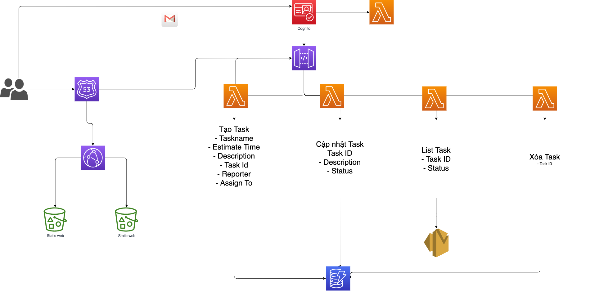

# demo-project

## System 1

### Requirement

Bạn được yêu cầu thiết lập 1 kiến trúc cho hệ thống Quản lý công việc nội bộ. Người trong công ty có thể đăng kí, và đăng nhập. Người dùng đã đăng nhập có thể tạo việc, cập nhật, xem list công việc và xóa công việc. Yêu cầu sử dụng Serverless, tối giản hóa công việc quản lý, đơn giản hóa hệ thống và đẩy nhanh việc triển khai.

- Đăng nhập + Tạo tài khoản
    - AWS Cognito

- Các API
    - Tạo Task
    - Cập nhật Task
    - Xem danh sách Task
    - Xóa Task

- Lưu trữ:
    AWS DynamoDB
    attribute:
        - Partition Key: id (int)
        - Sort Key: Name (string)
        - Reporter: string
        - AssignTo: string
        - Description: string
        - Status: string (eg: Todo, Inprogress, Done)

- Các API
    - Tạo Task: 
        - Task Name
        - Task ID
        - Reporter
        - Assign To
        - Description
    - Cập nhật Task: 
        - Assign To
        - Description
    - Xem danh sách Task:
        - Task Name
        - Task ID
        - Description
    - Xóa Task:
        - Gắn delete == true

## Flow:

## Estimate Cost Pricing:
- https://calculator.aws/#/estimate?id=c09291fe150ff7cd966aa2ed3428d0c80260d288
- [Estimate Pricing](./My%20Demo%20Project.csv)

### Architect

